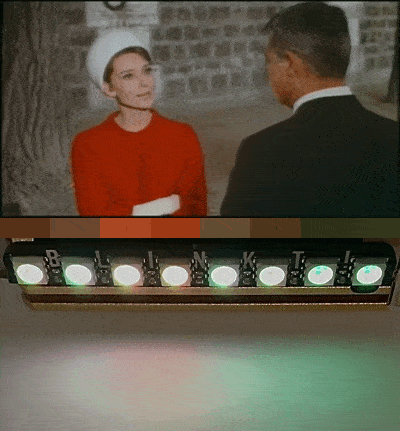

# Blinkt! Movie Player

Squishes down and plays a video on Pimoroni's excellent [Blinkt!](https://shop.pimoroni.com/products/blinkt) LED strip for the Raspberry Pi. Demo below shows a short video (Grant! Hepburn! Copyright ambiguity!), representative pixels, and output on the Blinkt!

Colour mapping from movies to the Blinkt! LEDs still needs some work.

## Scripts

Included are 2 sample Blinkt! movie (BMOV) files, the short demo above and a full length 1.h53m movie.

* `mp4tobmov.py [mp4_filename] [bmov_filename]` - Converts an MP4 into a BMOV movie
* `playmbov.py [bmov_filename]` - Plays a BMOV movie on Blinkt!
* `makedemo.sh` - creates the demo image (uncomment `wget` if you don't already have the movie)

## Uses

* Fake TV lighting while you're out (a charade)
* Ambient film lighting

## Requirements

* Working installs of [ffmpeg](https://ffmpeg.org/), [ImageMagick](https://imagemagick.org/index.php)
* [Blinkt!](https://github.com/pimoroni/blinkt) and [Pillow](https://python-pillow.org/) libraries for Python 3